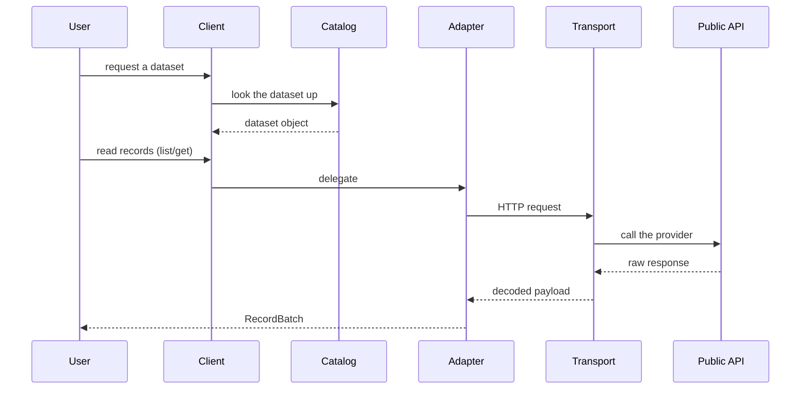
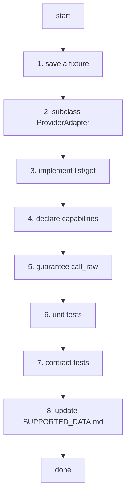

# AGENTS.md

> **[POLICY.md](./docs/governance/POLICY.md) is the single canonical source for
> project-management and review policy.** Epic, Issue, Priority, Review Level,
> Verification and Release rules come from there. This file keeps only what is
> specific to this repository — build commands and directory rules. POLICY.md wins
> any conflict.

## Purpose

This repository is built for agent-driven development. It is a Python 3.10+
framework with a small, stable public API and one adapter per provider.

## Read these first

1. `VALIDATION.md`
2. `PRD.md`
3. `ARCHITECTURE.md`
4. `CANONICAL_MODEL.md`
5. `PROVIDER_ADAPTER_CONTRACT.md`
6. `API_SPEC.md`
7. `PACKAGING.md`

## Working principles

- Keep the public API small.
- Do not turn a provider's quirk into fake universal semantics.
- Do not remove the raw escape hatch.
- Do not mark a capability as supported before a test proves it.
- Keep provider complexity inside the provider adapter.
- Update tests and documentation in the same change as the behaviour.
- `SUPPORTED_DATA.md` is the single source of truth for which providers and
  datasets are supported.
- When a provider's or dataset's support status or verification level changes,
  update `SUPPORTED_DATA.md` in the same PR.
- Mark something *supported* only once fixture, unit and contract tests pass.
- Mark *live-API verified* only once a real-API integration test exists and
  passes. Until then it stays *test verified*.

## Language policy

> [ADR 0003](docs/adrs/0003-language-policy.md) is canonical. The evidence
> (measurements across ten Korean OSS projects) and the rejected alternatives are
> there. This is the summary.

**Titles are English; bodies are free.** Titles show up in lists, searches and
release notes.

| Area | Language |
|---|---|
| Code identifiers, comments, docstrings | English |
| Commit messages | English |
| **PR titles** | English (Conventional Commits) — a squash merge turns it into a commit |
| CHANGELOG and release notes | English |
| **Governance documents** (`AGENTS.md`, `CONTRIBUTING.md`) | English |
| **Implementation contracts** (`PROVIDER_ADAPTER_CONTRACT.md`, `API_SPEC.md`) | English |
| **Design rationale** (`VALIDATION.md`, `ARCHITECTURE.md`, ADRs) | Korean |
| **README** | Two files: `README.md` in Korean, `README.en.md` in English, kept in step by `scripts/check_readme_parity.py` (ADR 0003) |
| **Issue titles** | English |
| Issue bodies | Korean or English |
| PR bodies and review comments | Korean or English |
| Korean-domain documents (`docs/providers/`, 활용신청, 공공누리 terms) | Korean |
| User-visible string literals | **Out of scope** — runtime behaviour, decided separately |

Operating rules:

- Answer an issue in the language it was written in.
- Write `good first issue` in English, or in both.
- **Do not let English block a contribution.** If a title is hard to write in
  English, open it in Korean and say so — triage and review will sort it out.

### Comments and docstrings are gated, not merely requested

The rule above went unenforced long enough to accumulate thousands of Korean
comments. That debt is paid, and in this repository the gate is
`scripts/check_english_comments.py` with **zero tolerance**: any Korean comment or
docstring under `src`, `tests` or `scripts` fails CI (#517). Files that
`kpubdata scaffold` generates are held to the same gate (#626). The ratchet
variant, `check_korean_comments.py`, is kpubdata-builder's.


## 확인은 기계가 한다

[POLICY 18.2](docs/governance/POLICY.md) and [VERIFICATION.md](docs/governance/VERIFICATION.md) are canonical. Three rules
carry most of the weight:

- **A sentence with a number in it comes from a command.** Run it in the same breath
  and paste the output. A figure recalled from memory is not a figure.
- **Sweep with `git ls-files`, not with paths you chose.** Ask the repository what it
  has. A hand-written path list is how `__tests__/` got missed.
- **A rule without a gate is a wish.** When you add a rule, add the command that
  checks it, wire it into CI, and write the test that shows it failing. Without the
  third, nobody knows the gate works.
- **An absent check is not a failure — it is a stop.** A required status check no
  workflow produces leaves every pull request BLOCKED for ever, because GitHub waits
  for it rather than reporting it. The way past is `--admin`, which skips every other
  check too. Require the one aggregate `CI gate` job, never a matrix-suffixed name,
  and run `scripts/check_required_checks.py` (in kpubdata) after touching a matrix.

Existing debt is frozen with a **ratchet** — the baseline holds today's per-file
count and the check fails only when a count grows. Fixing everything first means
starting nothing.

Say "done" with the command's output. If tests failed, paste the failure. If a step
was skipped, say it was skipped.

## Labels — what an agent applies

**[POLICY.md](./docs/governance/POLICY.md) sections 2.1, 2.1.1 and 2.1.2 are the label reference.**
This file deliberately does not copy the table: a second copy goes stale, and the
first draft of this section already dropped the Severity axis that POLICY defines.

What is specific to agents:

- A new issue carries **at least one `epic:*`**. Its title starts with a
  Conventional Commits type — `fix(localdata): empty wrapper becomes a phantom row` —
  and the `type:*` label follows from the title (POLICY 2.1.3). **Never set `type:*`
  by hand**, and change the title rather than the label when the type was wrong.
- Pull request titles use the same types; the `PR title` check fails otherwise. The
  allowed list lives in kpubdata's `scripts/conventional_title.py`, and the rules in
  [POLICY 2.1.3](docs/governance/POLICY.md) — the one place all three repositories read.
  Merges are squash-only, so the PR title becomes the commit title on `main`. Do not put
  an issue number in a PR title; write `Closes #N` in the body.
- Leave Priority off when there is no evidence for it. POLICY 8 requires
  `Impact:`, `Blocks:` and `Evidence:` for High and above, and a rating without
  evidence is a wrong rating.
- Do not prefix a title with `GOV-01:` or `WH-03:`. Those are serial numbers from
  a backlog document, not the issue's name. The type is the only prefix.
- A pull request labelled `review:R3` cannot merge until someone other than its
  author, with write access, approves it: the required `R3 review` check fails until
  then (POLICY 14.1). The author's own approval, a bot's, and one followed by a
  request for changes do not count. Ask for the review; do not remove the label.

What an agent does not do:

- Promote to `priority:high` or `priority:critical` — that is a person's judgement
  (POLICY 8, 14).
- Create a label that POLICY's table does not list. Adding one goes through
  `epic:governance`.
- Lower a `review:*` level.
- Create an Epic issue. Epic is a label (POLICY 4.1).
- Substitute `P0`/`P1`/`P2` mechanically for `priority:*`. POLICY 8 requires a
  re-rating from zero, so that a wrong priority does not survive under a new name.

## Dataset publishing

Publishing (HuggingFace and Kaggle uploads) lives in
[kpubdata-builder](https://github.com/yeongseon/kpubdata-builder). This repository
only collects and normalises. See the builder's AGENTS.md for publishing rules.

## Branch rules

- The default branch is `main`. **Never push to `main` directly.** Branch
  protection now enforces this, so a direct push is refused rather than merely
  discouraged.
- Always work on a feature branch and open a PR.
- Branch names: `feat/issue-<number>-<short-description>`,
  `fix/issue-<number>-<short-description>`, `docs/<short-description>`.
- Never force-push to `main`. Never delete `main`.
- Do not rename or delete a branch you did not create.
- If a git operation is not obviously safe, **ask instead of guessing.**

## Releases

Cadence and order live in [docs/compatibility.md §5.1](docs/compatibility.md#release-cadence);
who may do what lives in POLICY 14. This section keeps only what applies to an
agent.

- **kpubdata releases on demand, at most once every seven days** (#685). It releases
  when there is a reason — a downstream repository is blocked, a security fix, or
  accumulated changes — and the `release-window` gate refuses a release less than
  seven days after the last final one, in KST. kpubdata `main` is never frozen.
- **Builder and Studio release once a month**, in the week holding the month's last
  Thursday, and that week freezes *their* `main` branches. A critical patch (a
  security fix or a release-blocking defect) may go out at any time, and must name its
  issue: `critical_patch` + `critical_issue` on a dispatch, or a `Critical-Patch: #N`
  line in the release pull request's body.
- **Never recommend a release outside the rule to unblock work.** Work that needs an
  unreleased kpubdata change runs against kpubdata `main` in Builder's early-warning
  job, and the pin moves with the next kpubdata release.
- **Prepare, do not release.** An agent may tidy the CHANGELOG's Unreleased section,
  run a release workflow with `dry_run`, and draft the version and pin pull requests.
  Pushing a tag, creating a GitHub Release, approving the PyPI environment and
  changing what a release contains are a person's (POLICY 14).
- **Propose the bump from the CHANGELOG, with the reason.** In 0.x, a breaking change
  or a new feature is minor; fixes alone are patch.
- **Write what a release changes under `## [Unreleased]` in `CHANGELOG.md`, as you
  merge it.** The prepare job dates that section and the release job publishes it as
  the notes (#595). An empty `[Unreleased]` stops the release.
- **Builder and Studio share one version** (ADR 0004). They ship as one application,
  so a release that only changed one of them still raises both. kpubdata releases only
  when it has a reason, so it has nothing to skip.
- **Target Release is a month (`2026-10`), not a version.**

## When to write a plan

Before work that spans several files or affects the architecture, write or update
a plan in a local file covering:

- scope
- affected modules
- risks
- verification steps

## Quality gates

Run these before calling work done:

```bash
uv sync --extra dev
uv run ruff check .
uv run ruff format --check .
uv run mypy src
uv run pytest
uv run python -m build
uv run --extra docs mkdocs build --strict
make verify   # spec datasets: schema -> fixture -> replay -> example
```

## Adding a dataset (spec-based) — the default path for an agent

> Adding a dataset means **writing a spec YAML**, not writing code. Whether it is
> finished is decided mechanically, by the exit code of
> `make verify DATASET=<id>`.

### Checklist

1. [ ] Read the usage guide from the data.go.kr URL in the issue. If
   `scripts/fetch_guide.py` has been run, check the
   on-demand cache under `docs/sources/{dataset}/guide.txt` (generated by
   **generated and not in the repository**, so read the URL directly when it is
   absent.
2. [ ] Copy whichever of the three golden examples is closest and write
   `src/kpubdata/specs/{provider}/{dataset_key}.yaml`.
   - simple: `datago.hospital_info` · paginated: `datago.apt_trade` · XML:
     `datago.village_fcst`
   - The contract is `src/kpubdata/specs/schema.json`. Enum values come from the
     Phase 0 inventory in `docs/internal/adapter-inventory.md`.
3. [ ] `make record DATASET={provider}.{dataset_key}` — records the three
   fixtures (raw, meta, expected) against the live API.
4. [ ] Write `examples/{provider}/{dataset_key}.py`. Its parameters must match
   the spec's `examples[]` exactly — that is the replay matching contract — and it
   needs at least one meaningful assertion.
5. [ ] Repeat until `make verify DATASET={provider}.{dataset_key}` passes. All
   four stages are judged mechanically.
6. [ ] Update `SUPPORTED_DATA.md` and regenerate the documentation examples
   (`uv run python scripts/gen_docs_examples.py`).

### Paths you may change (dataset work)

`src/kpubdata/specs/`, `examples/`, `tests/fixtures/`, `SUPPORTED_DATA.md`

### Paths you may not change (dataset work)

`src/kpubdata/core/` (executor, bridge, spec loader), `tests/contract/`,
`scripts/`, `Makefile`, `.github/`

### Forbidden

- Writing or editing a fixture by hand. The meta hash check will catch it —
  fixtures come from `make record` only.
- Skipping a test or weakening an assertion (`assert True` and similar).
- Using `status: broken` to dodge a verification failure.
- Writing an example script with parameters that differ from the spec's
  `examples[]`. Replay matching will fail.

### When you are stuck

After three failures at the same point, add the `needs-human` label, leave a
summary of the cause on the issue, and stop.

### Traps found in practice

- Apartment transaction fields (`RTMSDataSvc*`) are in **English**
  (`dealAmount`, `aptNm`, `umdNm`), not Korean.
- Short-term forecast 2.0 categories are `TMP` and `PCP`, not the older `T1H`
  and `RN1`.
- The KMA date parameter (`base_date`) only answers for recent releases. Once it
  ages out, refresh the example and the fixture together with `make record`.
- data.go.kr has four envelope variants (standard, gyeonggi, its_flat, odcloud).
  See `envelope_style`.
- Providers with a custom adapter (krx and others) follow the adapter rules
  below, not this procedure. See `docs/internal/custom-adapters.md`.
- **Many Dev service variants (`RTMSDataSvc*Dev` and similar) are retired.** The
  non-Dev service is usually fine, so check that first — it may already be
  supported, making the request a duplicate.
- Probe the service once for real before writing a spec. A service documented as
  live may be retired (the old pharmacy `Ermct` service, the `MinuDust` family)
  or the key may not be registered for it (`MsrstnInfoInqireSvc`).

## Adapter rules

When adding a provider adapter:

- Add a fixture response.
- Add unit tests.
- Add contract tests.
- Document capabilities honestly.
- Keep `call_raw` working.

## Public API changes

When a public method, public model or canonical exception changes:

- Update `API_SPEC.md`.
- Update `PRD.md` if the requirement changed.
- Add an entry under `## [Unreleased]` in `CHANGELOG.md`. The release job takes the
  notes from that section and stops when it is empty.

## Independence rules

> [ADR 0007](docs/adrs/0007-independence-rules.md) is canonical.

KPubData is a standalone Python SDK. KPubData Builder and KPubData Studio are
related projects built on top of it. Dependencies flow one way only:
**Studio → Builder → KPubData**. "Core" is an architecture role word, never a
product name.

What this means for work in this repository:

- **Never import or depend on `kpubdata_builder` or `kpubdata-studio`** — not in
  `src/`, not in `pyproject.toml` (Rules 1–2).
- **A public API must make sense without Builder or Studio**, and terminology is
  not changed only for their UX (Rules 3–4).
- **The public API is the names in `kpubdata.__all__`**, their documented methods
  (`API_SPEC.md`) and the canonical model. Underscore modules (`_probe`, `_hosts`,
  `_typing`), adapter helpers, transport internals, fixtures and the repository
  layout are private. If Builder needs something private, propose a public API here
  instead of letting Builder reach in (Rules 5–6).
- **Compatibility across repositories is explicit and versioned**; "all the mains
  work together today" is not a contract (Rules 11–12).

ADR 0007 does not change ADR 0004. Rule 10 reads as "independently *releasable*";
whether Studio keeps sharing Builder's version number is the owner's open decision.

---

## How this project fits together

KPubData gives one interface to Korean public data APIs that each have their own
conventions. A provider's quirks stay inside its adapter; everything above the
adapter sees the same model.

### Vocabulary

| Term | Meaning |
| :--- | :--- |
| **Provider** | The institution serving the data (공공데이터포털, 기상청, …) |
| **Adapter** | Translates one provider's API conventions into the KPubData model |
| **Dataset** | A specific collection of records (short-term forecast, air quality, …) |
| **Query** | The filter conditions sent to a dataset |
| **RecordBatch** | The normalised records that come back |
| **Canonical Model** | The single model every provider's data is mapped onto |
| **Raw Escape Hatch** | `call_raw`, for reaching the original API when the normalised path is not enough |

### Request flow

```text
[User] -> [Client] -> [Dataset] -> [Adapter] -> [Transport] -> [Public Data API]
                                     ^              |
                                     |              v
[User] <- [RecordBatch] <----------- [Parser] <--- [Raw Response]
```



## Agent coding rules

### Prompts that work

- "Add the `air_quality` dataset to `datago` as a spec. Use the `hospital_info`
  golden example, write `specs/datago/air_quality.yaml`, and get `make record`
  then `make verify` to pass." (the recommended path — see *Adding a dataset*)
- "Add a new `Dataset`, `air_quality`, to the `datago` adapter. Follow
  `PROVIDER_ADAPTER_CONTRACT.md` and add a response sample under
  `tests/fixtures`." (the custom-adapter path)
- "Add a `to_pandas()` method to `RecordBatch` with unit tests."

### Forbidden

- **`typing.Any` as a habit.** Define the actual type.
- **`type: ignore`.** Fix the type error instead of silencing it.
- **Deleting tests.**
- **Fake universal semantics.** Do not present a capability only one provider has
  as though every provider supports it.

### Before handing work back

- [ ] Does `mypy` pass?
- [ ] Does `pytest` pass?
- [ ] Did you leave everything outside `src/` alone?
- [ ] Did you avoid adding a public method that `API_SPEC.md` does not define?

## Directory layout

```text
src/kpubdata/
├── __init__.py            # package entry point
├── client.py              # the entry point users touch first
├── catalog.py             # the list of available datasets
├── cli.py                 # command-line interface
├── config.py              # settings and API keys
├── registry.py            # provider adapter registration and validation
├── scaffold.py            # scaffolding for a new provider
├── exceptions.py          # canonical errors
├── core/                  # core logic and abstract classes
│   ├── capability.py      # capability metadata
│   ├── dataset.py         # dataset reference model
│   ├── models.py          # Query, RecordBatch and friends
│   ├── protocol.py        # the adapter protocol
│   └── representation.py  # data representations
├── transport/             # HTTP
│   ├── http.py            # HTTP client
│   ├── cache.py           # response cache
│   ├── decode.py          # response decoding
│   └── retry.py           # retry logic
└── providers/             # one package per institution
    ├── _common.py         # shared helpers
    ├── manifest.py        # provider metadata
    ├── bok/               # 한국은행 — Bank of Korea
    ├── datago/            # 공공데이터포털 — data.go.kr
    ├── kosis/             # KOSIS — Statistics Korea
    ├── krx/               # KRX — Korea Exchange
    ├── law/               # 국가법령정보센터 — Korea Law Information Center
    ├── localdata/         # 지방행정인허가데이터 — local government permits
    ├── lofin/             # 지방재정365 — LOFIN local finance
    ├── semas/             # 소상공인시장진흥공단 — SEMAS
    ├── seoul/             # 서울열린데이터광장 — Seoul Open Data Plaza
    │   └── datasets/      # split out, this provider is large
    ├── sgis/              # SGIS — Statistical Geographic Information Service
    ├── kipris/            # KIPRIS — patent search
    ├── korean/            # 표준국어대사전 — Standard Korean Dictionary
    ├── neis/              # NEIS — school information
    └── fds/               # 식품이력추적 — food traceability (MFDS)
```

### Which file to change

- **Adding an institution**: create a directory under `providers/` and implement
  the abstract classes from `core/`.
- **Changing how records are queried**: `Query` or `RecordBatch` in
  `core/models.py`.

## Writing an adapter

### Checklist

1. [ ] Save a real response (XML or JSON) to
   `tests/fixtures/<provider>/<dataset>.json`.
2. [ ] Subclass `ProviderAdapter`.
3. [ ] Implement `list()`, `get()` and whatever else the provider supports.
4. [ ] Declare what works in `capabilities`.
5. [ ] Guarantee `call_raw` still returns the original payload.
6. [ ] Add unit tests under `tests/unit/providers/`.
7. [ ] Add contract tests under `tests/contract/`.
8. [ ] Update `SUPPORTED_DATA.md` (status, verification, auth, official docs,
   notes).



### The core abstractions

- **ProviderAdapter** — the base every adapter extends. Handles authentication,
  request construction and response parsing.
- **DatasetRef** — addresses one dataset.
- **Query** — carries the filter conditions.
- **RecordBatch** — a batch of normalised records.

### Testing

- **Fixture-based tests** replay a saved response instead of standing up a fake
  server, and check that the adapter parses it correctly.
- **Contract tests** check that an adapter honours the KPubData contract. Every
  adapter passes the same interface.

---

## Related documents

### In this repository

| Document | What it covers |
| :--- | :--- |
| [CONTRIBUTING.md](./CONTRIBUTING.md) | How to contribute |
| [ARCHITECTURE.md](./ARCHITECTURE.md) | System architecture |
| [PROVIDER_ADAPTER_CONTRACT.md](./PROVIDER_ADAPTER_CONTRACT.md) | The adapter contract |
| [CANONICAL_MODEL.md](./CANONICAL_MODEL.md) | The canonical data model |
| [VALIDATION.md](./VALIDATION.md) | Architecture validation |
| [API_SPEC.md](./API_SPEC.md) | Python API specification |
| [PRD.md](./PRD.md) | Product requirements |
| [PACKAGING.md](./PACKAGING.md) | Packaging and distribution |
| [SUPPORTED_DATA.md](./SUPPORTED_DATA.md) | Which public data is supported, and how far |
| [docs/governance/POLICY.md](./docs/governance/POLICY.md) | Project management and review policy |
| [docs/governance/BACKLOG.md](./docs/governance/BACKLOG.md) | Backlog structure and ordering |

### KPubData product family

| Repository | Document | What it covers |
| :--- | :--- | :--- |
| [kpubdata-builder](https://github.com/yeongseon/kpubdata-builder) | [AGENTS.md](https://github.com/yeongseon/kpubdata-builder/blob/main/AGENTS.md) | Builder agent guide |
| [kpubdata-studio](https://github.com/yeongseon/kpubdata-studio) | [AGENTS.md](https://github.com/yeongseon/kpubdata-studio/blob/main/AGENTS.md) | Studio agent guide |
| [kpubdata-watch](https://github.com/yeongseon/kpubdata-watch) | [AGENTS.md](https://github.com/yeongseon/kpubdata-watch/blob/main/AGENTS.md) | Watch agent guide — public-data reliability |
