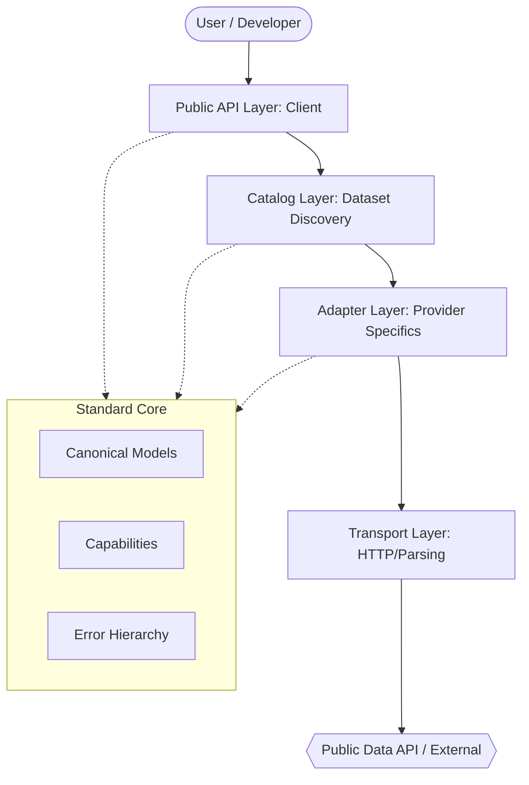
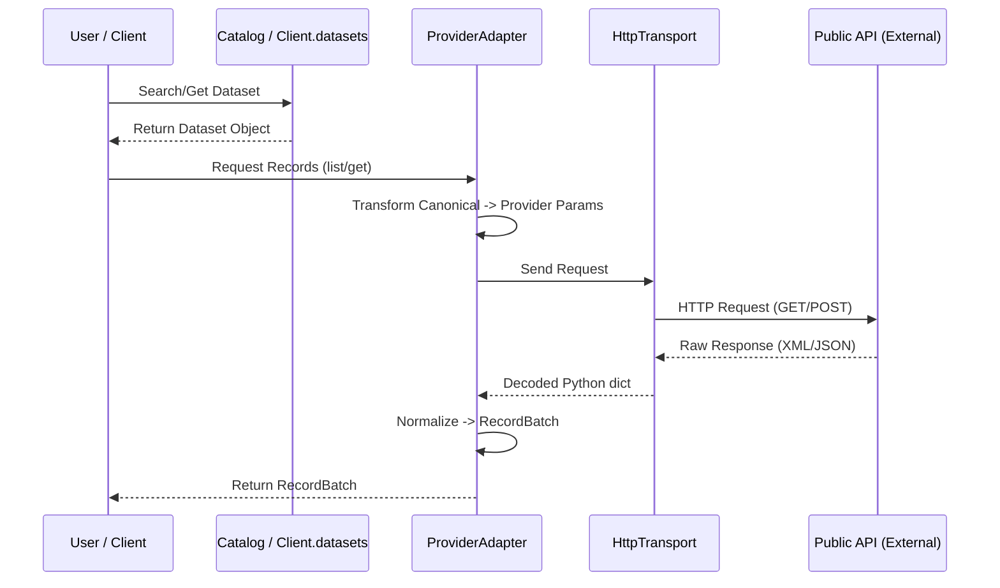
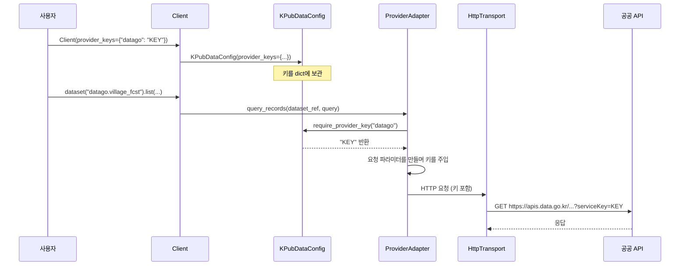
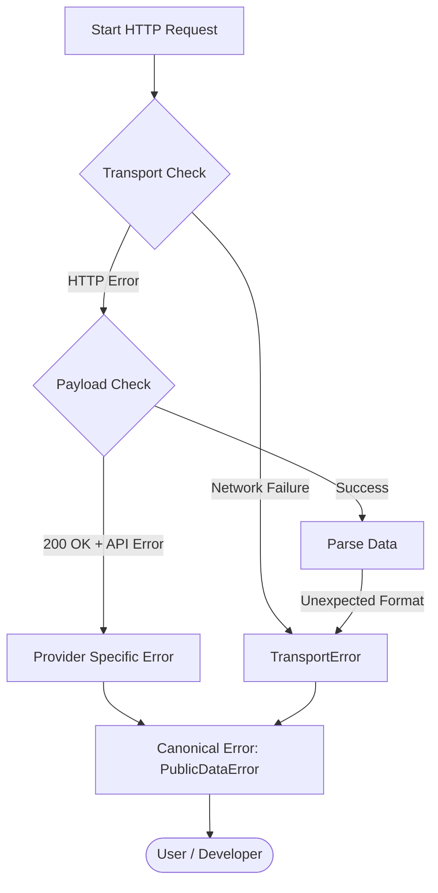
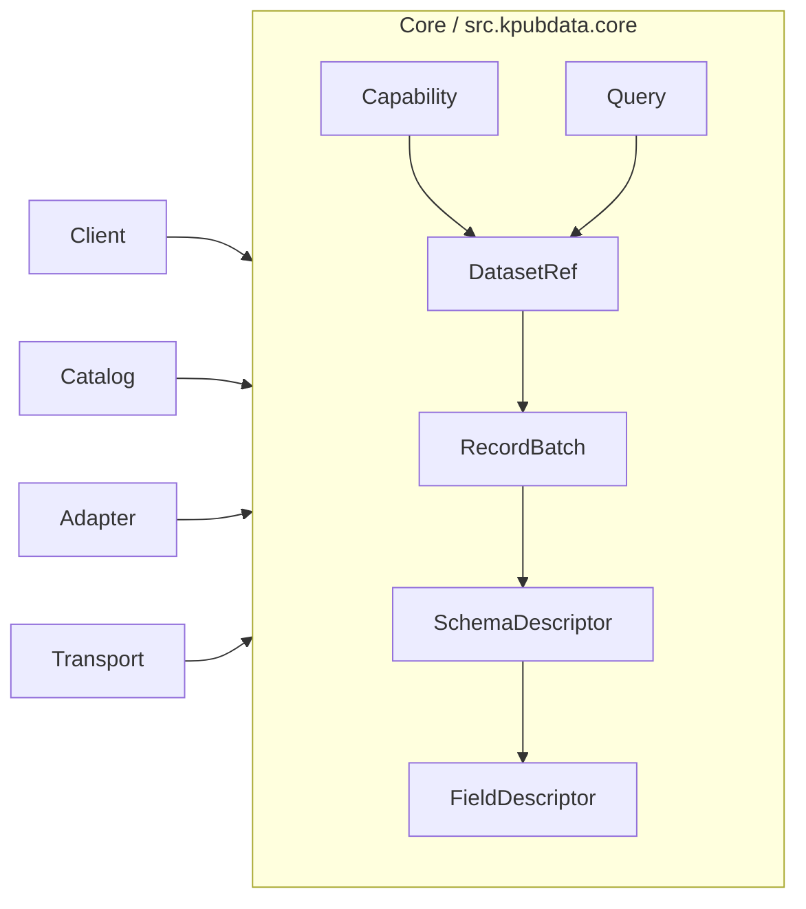
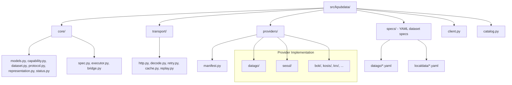

# Architecture — KPubData

## 1. Architectural style

KPubData uses a **dialect-inspired layered architecture**.



It borrows the philosophy of systems like SQLAlchemy:

- keep a small and stable core
- isolate backend-specific behavior in adapters/dialects
- offer a uniform developer-facing entry point
- preserve an escape hatch to lower-level behavior

It does **not** try to recreate SQL itself or a universal query language.

## 2. Core idea



```text
Client
  -> Catalog / discovery
  -> Dataset binding
  -> ProviderAdapter
  -> Transport
  -> Parse / normalize
  -> Canonical result
```

## 3. 왜 이런 구조인가? (초보자를 위한 비유)

KPubData의 구조는 **대형 은행의 통합 창구**와 비슷합니다.

여러분이 국민은행, 신한은행, 우리은행에 각각 계좌가 있다고 가정해 봅시다. 예전에는 각 은행마다 가서 서로 다른 양식의 종이에 입금 신청을 해야 했습니다. 어떤 은행은 이름을 먼저 쓰고, 어떤 은행은 계좌번호를 먼저 써야 하죠.

KPubData는 이 모든 은행을 대신 처리해주는 **"통합 키오스크"**를 만드는 것과 같습니다.

- **SQLAlchemy 비유**: 데이터베이스마다 SQL 언어가 조금씩 다르지만(MySQL, PostgreSQL 등), SQLAlchemy를 쓰면 하나의 파이썬 코드로 모든 데이터베이스를 다룰 수 있습니다. 공공데이터 API도 마찬가지입니다. 기관마다 데이터 주는 방식은 다르지만, 사용자는 KPubData라는 공통 언어로 데이터를 요청합니다.
- **핵심 비유 (은행 창구)**:
  - **사용자**: "나 입금하고 싶어"라고 요청합니다.
  - **통합 창구 (Client)**: "어느 은행인가요?"라고 묻고 해당 은행의 전용 양식을 꺼냅니다.
  - **전용 양식 (Adapter)**: 각 은행마다 다른 서류 칸(API 파라미터)에 맞춰 정보를 채워 넣습니다.
  - **입금 행위**: 은행마다 절차는 다르지만, 결과적으로 "내 통장에 돈이 들어온다"는 결과는 같습니다.

## 4. 각 레이어 상세 설명

### 4.1 Core (핵심부)
*   **이 레이어가 하는 일**: 전체 시스템에서 사용하는 표준 규격을 정의합니다. 비유하자면, 모든 은행에서 공통으로 사용하는 "화폐 단위(원)"나 "계좌"라는 개념을 정의하는 곳입니다.
*   **핵심 파일**: `core/models.py`, `core/capability.py`, `core/status.py`
*   **수정 상황 예시**: 모든 데이터셋에 "데이터의 신뢰도 점수"라는 새로운 표준 정보를 추가하고 싶을 때.
*   **코드 예시**:
    ```python
    # 모든 데이터는 이 형태(RecordBatch)로 포장되어 사용자에게 전달됩니다.
    # (일부 필드만 표시 — 전체 정의는 CANONICAL_MODEL.md 6.5)
    @dataclass
    class RecordBatch:
        items: list[dict]
        total_count: int | None
    ```
*   **데이터셋 메타데이터**: `DatasetRef.status`는 그 데이터셋이 어디까지 검증됐는지(`DatasetStatus`)를, `DatasetRef.to_dict()`는 저장·전송용 JSON dict를 돌려줍니다. `RecordBatch.validation`은 정규화 중 발견한 필드 단위 문제(`ValidationReport`)입니다. 정의는 [CANONICAL_MODEL.md](./CANONICAL_MODEL.md) 6.3·6.5에 있습니다.

### 4.2 Catalog (도서 목록)
*   **이 레이어가 하는 일**: 어떤 데이터셋이 어디에 있는지 목록을 관리합니다. 도서관의 "도서 검색 키오스크" 같은 역할입니다.
*   **핵심 파일**: `catalog.py`, `registry.py`
*   **수정 상황 예시**: "미세먼지"라고 검색했을 때 어떤 데이터셋들을 보여줄지 결정하는 로직을 바꿀 때.
*   **코드 예시**:
    ```python
    # 사용자가 키워드로 데이터셋을 찾을 수 있게 도와줍니다.
    datasets = client.datasets.search("forecast")
    ```

### 4.3 Provider Adapter (통역사)
*   **이 레이어가 하는 일**: 기관별로 제각각인 API 요청 방식을 KPubData 표준 방식으로 변환합니다. 한국어를 영어로, 영어를 한국어로 바꿔주는 통역사와 같습니다.
*   **핵심 파일**: `providers/datago/adapter.py`, `providers/seoul/adapter.py` (커스텀 어댑터), `core/executor.py` (spec 실행기)
*   **두 가지 경로**: 데이터셋은 (1) provider 패키지의 `catalogue.json` + 커스텀 어댑터, 또는 (2) `src/kpubdata/specs/<provider>/<dataset>.yaml` 선언 spec 중 하나로 정의됩니다. spec은 `core/spec.py`가 읽고, `core/executor.py`의 `SpecExecutor`가 요청 조립·응답 해석·필드 캐스팅을 수행하며, `SpecDatasetAdapter`가 이를 `ProviderAdapter` 프로토콜로 노출합니다. 한 provider에 둘이 함께 있으면 `bootstrap.py`가 등록 시점에 `core/bridge.py`의 `CompositeProviderAdapter`로 둘을 합치고, 같은 `dataset_key`는 spec이 우선합니다.
*   **수정 상황 예시**: 기상청 API의 주소가 바뀌었거나, 결과 데이터의 이름이 `nx`에서 `grid_x`로 변경되었을 때.
*   **프로토콜 분기**: `catalogue.json`의 `provider_family` 필드(예: `"odcloud"`)를 통해 동일 어댑터 내에서 프로토콜을 분기합니다. ODcloud(`api.odcloud.kr`)는 페이지네이션(`page`/`perPage`), 응답 구조(`data[]` 플랫 배열), 포맷 파라미터 생략 등 표준 data.go.kr과 다른 규약을 따릅니다.
*   **코드 예시**:
    ```python
    # 개념 예시입니다 — 실제 메서드 이름은 어댑터마다 다릅니다
    # (datago: `_build_base_params`, spec 실행기: `SpecExecutor.build_params`).
    def _build_params(self, query):
        return {"base_date": query.filters["base_date"], "nx": query.filters["nx"]}
    ```

### 4.4 Transport (운송팀)
*   **이 레이어가 하는 일**: 실제로 인터넷을 통해 데이터를 주고받는 일을 합니다. 택배 기사님처럼 목적지까지 안전하게 데이터를 배달합니다.
*   **핵심 파일**: `transport/http.py`
*   **수정 상황 예시**: 인터넷이 불안정할 때 자동으로 재시도(Retry)하는 횟수를 늘리고 싶을 때.

### 4.5 Public API (창구 직원)
*   **이 레이어가 하는 일**: 사용자가 가장 처음 만나는 인터페이스입니다. 친절한 창구 직원처럼 사용자의 요청을 받아 적절한 레이어로 전달합니다.
*   **핵심 파일**: `client.py`
*   **수정 상황 예시**: 사용자가 `client.get_weather()` 처럼 더 편한 방식으로 데이터를 부르게 하고 싶을 때.

## 5. 데이터 흐름 상세 (Data Flow)

사용자가 `client.dataset("datago.village_fcst").list(base_date="20250401", base_time="0500", nx=55, ny=127)`을 호출할 때의 여정입니다.

1.  **1단계: 데이터셋 찾기 (Discovery)**
    - `Client`가 `Catalog`에게 "datago.village_fcst"가 있는지 물어봅니다.
    - `Catalog`는 등록된 어댑터들 중 `datago` 어댑터를 찾아 해당 데이터셋 정보를 가져옵니다.
2.  **2단계: 요청 변환 (Adapter Translation)**
    - `Dataset` 객체의 `list()` 함수가 호출되면, 내부적으로 어댑터의 `query_records()`를 호출합니다.
    - `datago.village_fcst`는 spec(`specs/datago/village_fcst.yaml`)으로 정의되어 있으므로 `CompositeProviderAdapter` → `SpecDatasetAdapter.query_records()` → `SpecExecutor.query()` 순으로 전달됩니다. spec이 없는 데이터셋은 `DataGoAdapter.query_records()`가 직접 처리합니다.
    - 실행기는 spec에 선언된 파라미터(`base_date`, `base_time`, `nx`, `ny`)에 인증키(`serviceKey`)·페이지(`pageNo`/`numOfRows`)·포맷(`dataType`) 파라미터를 더해 요청을 조립합니다.
3.  **3단계: 데이터 가져오기 (Transport)**
    - 조립된 파라미터를 들고 `HttpTransport`가 spec의 `endpoint.base_url`(`apis.data.go.kr/1360000/VilageFcstInfoService_2.0`)로 요청을 보냅니다.
4.  **4단계: 응답 해석 (Parsing & Normalization)**
    - 서버에서 온 XML 또는 JSON 데이터를 `transport/decode.py`가 파이썬 딕셔너리로 바꿉니다.
    - 어댑터(여기서는 spec 실행기)는 이 데이터를 다시 KPubData 표준 규격에 맞게 다듬고, spec의 `fields`에 따라 타입을 캐스팅한 뒤 그 결과를 `RecordBatch.validation`에 남깁니다.
5.  **5단계: 결과 반환 (Return)**
    - 최종적으로 예쁘게 포장된 `RecordBatch` 객체가 사용자에게 전달됩니다.

## 6. 인증 흐름 (Authentication Flow)

### 6.1 개요

공공데이터 API를 사용하려면 각 기관에서 발급한 **인증키(API Key)**가 필요합니다. KPubData는 이 키를 사용자로부터 받아 각 기관이 요구하는 방식으로 HTTP 요청에 주입합니다.

핵심 설계 원칙:
- **키 저장은 `KPubDataConfig`에 집중**: 모든 기관의 키를 한 곳에서 관리합니다.
- **키 주입은 각 어댑터에 위임**: 기관마다 키를 넣는 위치와 파라미터 이름이 다르므로, 이 로직은 어댑터가 담당합니다.
- **환경변수 우선 해석**: 명시적으로 전달된 키 → `KPUBDATA_*` 환경변수 → fallback 환경변수 순으로 탐색합니다.

### 6.2 키 해석 우선순위

```mermaid
flowchart TD
    Start[키 요청: require_provider_key] --> E1{명시적으로 전달된 키?}
    E1 -- 있음 --> Use[키 반환]
    E1 -- 없음 --> E2{KPUBDATA_{PROVIDER}_API_KEY 환경변수?}
    E2 -- 있음 --> Use
    E2 -- 없음 --> E3{"{PROVIDER}_API_KEY" 환경변수?}
    E3 -- 있음 --> Use
    E3 -- 없음 --> Err[ConfigError 발생]
```

```python
# 1순위: 명시적 전달
client = Client(provider_keys={"datago": "MY_KEY"})

# 2순위: KPUBDATA_ 접두사 환경변수
# export KPUBDATA_DATAGO_API_KEY="MY_KEY"
client = Client.from_env()

# 3순위: 접두사 없는 환경변수 (fallback)
# export DATAGO_API_KEY="MY_KEY"
client = Client.from_env()
```

**관련 코드**: `src/kpubdata/config.py` → `KPubDataConfig.get_provider_key()`, `require_provider_key()`

> 참고: `Client(..., env_keys=False)`(`KPubDataConfig.env_fallback=False`)이면 1순위만 사용하고
> 환경변수는 읽지 않습니다. 다른 사람의 키를 든 클라이언트가 운영자 키로 빈칸을 채우지 않게
> 하기 위한 옵션입니다([API_SPEC.md](./API_SPEC.md) 2절).

> 참고: 어댑터는 `requires_api_key`로 키가 필요한지 선언합니다(`core/protocol.py`). 속성이
> 없으면 `Client`는 키가 필요한 provider로 봅니다. 내장 provider는 키 유무와 상관없이 모두
> lazy 등록되고, 키는 요청을 만들 때 읽습니다 — 이 선언은
> `Client.iter_authenticated_providers()`가 키가 필요한 provider만 골라내는 데 쓰입니다.
> `krx`가 `requires_api_key = False`인 유일한 built-in provider이며 실제 인증/백엔드 결정은
> 어댑터 계층에 남겨둡니다.

### 6.3 키의 내부 전달 경로



**핵심 메서드**: 키는 항상 `KPubDataConfig.require_provider_key("slug")`로 읽습니다. 대부분의 커스텀 어댑터는 이를 `_require_api_key()` 헬퍼로 감싸고, spec 실행기는 `SpecExecutor.build_params()`에서 spec의 `auth` 선언에 따라 직접 호출합니다. `sgis`는 `providers/sgis/auth.py`에서 consumer key/secret으로 토큰을 발급받고, `krx`는 키를 읽지 않습니다(`requires_api_key = False`).

## 7. 페이지네이션 전략 (Pagination Strategy)

KPubData는 대량의 데이터를 효율적으로 가져오기 위해 두 가지 페이지네이션 전략을 사용합니다.

### 7.1 전략 종류
- **오프셋 기반 (Offset-based)**: 페이지 번호를 이용해 데이터를 요청합니다. `next_page` 값이 반환됩니다.
- **커서 기반 (Cursor-based)**: 특정 지점을 가리키는 포인터(커서)를 이용해 다음 데이터를 요청합니다. `next_cursor` 값이 반환됩니다.

### 7.2 동작 원리 및 휴리스틱 (Heuristic)
어댑터는 가용한 정보에 따라 다음과 같이 다음 페이지 존재 여부를 결정합니다.
1. **정밀 계산**: 응답이 전체 개수를 알려주는 경우(datago의 `totalCount`, bok·lofin의 `list_total_count` 등), `page * page_size < total_count`로 `next_page`를 정확히 계산합니다.
2. **Best-effort 휴리스틱**: 같은 어댑터라도 응답에 전체 개수가 없으면 `len(items) == page_size` 공식을 사용합니다.
   - 현재 페이지의 아이템 개수가 요청한 페이지 크기와 같다면, 다음 페이지가 더 있을 것으로 가정합니다.
   - 이 방식은 마지막 데이터가 딱 페이지 크기에 맞춰 끝날 경우, 실제로 데이터가 없는 다음 페이지를 한 번 더 호출하는 **추가 fetch(Extra empty fetch)**가 발생할 수 있습니다. 이는 문서화된 트레이드오프(trade-off)입니다.

### 7.3 list_all()의 처리
사용자가 `list_all()` 메서드를 호출하면, KPubData는 어댑터가 반환하는 전략(`next_cursor` 우선, 없으면 `next_page`)을 자동으로 판단하여 모든 데이터를 순회합니다. 페이지 수가 `max_pages`(기본 1000)를 넘거나 같은 페이지·커서가 반복되면 `InvalidRequestError`를 던집니다.

어댑터가 선택 메서드 `query_records_all(dataset, query, *, max_pages=None)`을 제공하면 `Dataset.list_all()`은 페이지별 `query_records()` 대신 그것을 한 번 호출합니다(`core/dataset.py`). spec 데이터셋(`SpecDatasetAdapter.query_records_all`)이 이 경로를 씁니다. 컬럼 캐스팅을 전체 결과에 대해 한 번에 결정해야 페이지마다 타입이 갈리지 않기 때문에, **모든 페이지를 먼저 가져온 뒤** 페이지당 하나씩 `RecordBatch`를 내보냅니다. 가져온 페이지는 임시 파일에 두므로 메모리는 한 페이지 분량이지만, 도중에 한 페이지가 실패하면 앞서 가져온 페이지도 반환되지 않습니다. `CompositeProviderAdapter`는 모든 키에 대해 이 메서드를 가지므로 `supports_query_records_all(dataset_key)`로 그 키가 이 경로를 쓰는지 알려줍니다.

## 8. 자주 묻는 질문 (FAQ)


**Q: 새 데이터셋을 추가하려면 어디를 수정하나요?**
A: 기본 경로는 spec YAML(`src/kpubdata/specs/<provider>/<dataset_key>.yaml`)을 추가하는 것이며 코드 수정이 필요 없습니다([AGENTS.md](./AGENTS.md) "Adding a dataset"). 커스텀 어댑터를 쓰는 provider는 해당 어댑터(`providers/<provider>/adapter.py`)와 데이터 목록 파일(`providers/<provider>/catalogue.json`)을 수정합니다.

**Q: XML과 JSON 응답은 어떻게 다르게 처리하나요?**
A: `transport/decode.py`에서 데이터의 겉모습을 보고 자동으로 판단합니다. 어댑터는 그저 파이썬 객체(dict)로 변환된 데이터만 다루면 되므로 걱정할 필요 없습니다.

**Q: 에러가 발생하면 어떤 순서로 처리되나요?**
A: 먼저 인터넷 문제(TransportError)인지 확인하고, 그 다음 기관 서버의 응답 코드(AuthError, RateLimitError 등)를 확인하여 KPubData 표준 에러로 변환해 사용자에게 던집니다.



**Q: 테스트는 어떤 종류가 있고 뭘 검증하나요?**
A:
- **Unit Test**: 개별 함수가 잘 작동하는지 확인합니다.
- **Fixture Test**: 가짜 API 응답 데이터를 넣어두고 파싱이 정확한지 확인합니다.
- **Contract Test**: 어댑터가 표준 규약을 잘 지키고 있는지 확인합니다.

## 7. Layers (Original)

### 3.1 Core layer

Stable contracts shared across the whole framework.



Contains:

- `DatasetRef`
- `Representation`
- `Capability`
- `Query`
- `RecordBatch`
- `SchemaDescriptor`
- `DatasetStatus`
- `PublicDataError` hierarchy (defined in `exceptions.py`)

Design rule:

- the core changes slowly
- no provider-specific hacks unless repeated across multiple adapters

### 3.2 Catalog layer

Responsible for discovering and resolving datasets.

Responsibilities:

- listing/searching descriptors
- provider-aware lookup
- binding descriptors into dataset objects

### 3.3 Provider adapter layer

Each provider family implements an adapter that understands its own conventions.

Responsibilities:

- auth injection
- request building
- parameter transformation
- response parsing
- provider-specific error interpretation
- capability declaration
- raw-call support

### 3.4 Transport layer

Shared HTTP and parsing infrastructure.

Responsibilities:

- session management
- timeouts
- retries
- content-type detection
- common XML/JSON helpers

### 3.5 Public API layer

The developer-facing surface.

Responsibilities:

- ergonomic `Client`
- dataset-oriented operations
- convenience aliases where helpful

### 3.6 Optional adapters layer

Not part of the core runtime contract.

Examples:

- pandas export (`RecordBatch.to_pandas()`, the `kpubdata[pandas]` extra)
- adapters registered at run time (`Client.register_provider()`)

MCP adapter는 별도 레포(kpubdata-mcp 등)로 분리합니다. 코어 런타임에 포함하지 않습니다.

## 4. Main abstractions

### 4.1 Client

Top-level entry point.

Responsibilities:

- initialization/config
- provider registry access
- catalog access
- dataset binding

### 4.2 Dataset

A provider-aware bound object representing a queryable service/dataset.

Responsibilities:

- expose operations (`list`, `list_all`, `schema`, `call_raw`)
- surface capabilities
- preserve provider identity

### 4.3 ProviderAdapter

The extension point.

Responsibilities:

- compile canonical intent into provider-native requests
- parse provider-native responses into canonical results
- define supported capabilities
- declare whether a key is needed (`requires_api_key`)

The protocol is `core/protocol.py`. `SpecDatasetAdapter` (`core/executor.py`) is the
implementation that serves every dataset declared as a YAML spec; a custom adapter
under `providers/` serves the rest.

## 5. Why dataset-oriented instead of agency-oriented

End users usually want data like “subway arrivals” or “apartment trades,” not “the Ministry X API client.”

The public API should therefore prioritize datasets/services as the first-class mental model while still retaining provider identity for auth, debugging, and routing.

## 6. Why capabilities matter

Different datasets genuinely support different operations.

Examples:

- list only
- list + pagination
- single record lookup
- schema metadata
- raw download
- real-time feed semantics

A capability model prevents the framework from lying.

## 7. Why raw access is mandatory

Public-data APIs often:

- return errors in 200 bodies
- drift from docs
- mix XML and JSON expectations
- omit metadata in normalized forms

Therefore, every adapter must provide a raw escape hatch.

## 8. Package structure



```text
src/kpubdata/
  __init__.py            # public names (kpubdata.__all__)
  client.py
  config.py
  catalog.py
  exceptions.py
  registry.py
  bootstrap.py           # lazy registration of built-in providers, spec wrapping
  cli.py
  scaffold.py
  dataset_status.json    # packaged status table behind DatasetRef.status
  core/
    models.py            # DatasetRef, Query, RecordBatch, SchemaDescriptor, ValidationReport
    capability.py        # Operation, PaginationMode, QuerySupport
    representation.py
    status.py            # DatasetStatus and the other status vocabularies
    protocol.py          # ProviderAdapter protocol
    dataset.py           # bound Dataset (list, list_all, schema, call_raw)
    spec.py              # spec loader (SpecDefinition, discover_specs, find_spec)
    executor.py          # SpecExecutor, SpecDatasetAdapter
    bridge.py            # CompositeProviderAdapter (custom adapter + specs)
  specs/
    schema.json          # the spec contract
    datago/*.yaml
    localdata/*.yaml
  transport/
    http.py
    decode.py
    retry.py
    cache.py
    replay.py
  providers/
    manifest.py          # BUILTIN_PROVIDERS
    _common.py
    _datago_family.py    # shared base for localdata, semas
    bok/ datago/ fds/ kipris/ korean/ kosis/ krx/ law/
    localdata/ lofin/ neis/ semas/ seoul/ sgis/
      adapter.py
      catalogue.json
  # MCP adapter는 별도 레포(kpubdata-mcp 등)로 분리
```

Each provider package holds `adapter.py` and `catalogue.json`. `datago/` and `seoul/`
add `envelope.py`, `seoul/` a `datasets/` package, and `sgis/` an `auth.py`. There is
no `adapters/` package: pandas export is `RecordBatch.to_pandas()` in `core/models.py`.

## 9. Execution flow

### 9.1 Discovery flow

```text
Client.datasets.search("지하철")
  -> Catalog.search()
  -> ProviderAdapter.list_datasets() for each registered provider
  -> scoring in the catalog (substring, token overlap, fuzzy)
  -> DatasetRef[]
```

### 9.2 Query flow

```text
client.dataset("datago.apt_trade").list(...)
  -> Dataset.list(...)
  -> build Query
  -> ProviderAdapter.query_records(dataset_ref, query)
       (spec dataset: SpecDatasetAdapter -> SpecExecutor.query)
  -> Transport request
  -> parse / normalize
  -> RecordBatch
```

```text
client.dataset("datago.apt_trade").list_all(...)
  -> Dataset.list_all(...)
  -> adapter has query_records_all for this key?
       yes -> query_records_all(dataset_ref, query, max_pages=...)
              fetches every page, decides casting once, then yields RecordBatch per page
       no  -> Dataset.list(...) per page, following next_cursor / next_page
```

### 9.3 Raw flow

```text
dataset.call_raw(operation="list", params={...})
  -> ProviderAdapter.call_raw(...)
  -> raw payload / raw response object
```

## 10. Rules for core evolution

Promote something into the core only when at least one of these is true:

1. three or more adapters need it
2. it materially simplifies the public API
3. it improves correctness across providers

Do **not** change the core just because one adapter is weird.

## 11. Design constraints

- avoid deep inheritance trees
- prefer composition and small protocols
- keep canonical models minimal
- keep provider-specific richness in metadata and raw channels
- treat representation (`openapi`, `file`, `sheet`, `download`) as real metadata, not a footnote

## 12. 독립성 규칙 (Independence Rules)

KPubData 는 독립 Python SDK 다. KPubData Builder 와 KPubData Studio 는 그 위에 만들어진
관련 프로젝트이고, 의존은 **Studio → Builder → KPubData** 한 방향으로만 흐른다.
KPubData 는 Builder·Studio 에 의존하지 않고, 공개 API 는 둘 없이도 뜻이 성립해야 한다.

12개 규칙 전체와 공개/비공개 API 경계는 [ADR 0007](./docs/adrs/0007-independence-rules.md)
에 있다. 요약하면 공개 API 는 `kpubdata.__all__` 의 이름과 `API_SPEC.md` 에 문서화된
메서드, 정규 모델이고, `_` 로 시작하는 모듈·어댑터 헬퍼·transport 내부·fixture·저장소
구조는 비공개다.

---

## 관련 문서

### 이 저장소 내 문서
| 문서 | 설명 |
| :--- | :--- |
| [CANONICAL_MODEL.md](./CANONICAL_MODEL.md) | 표준 데이터 모델 정의 |
| [PROVIDER_ADAPTER_CONTRACT.md](./PROVIDER_ADAPTER_CONTRACT.md) | 어댑터 구현 규약 |
| [API_SPEC.md](./API_SPEC.md) | 파이썬 API 명세 |
| [PACKAGING.md](./PACKAGING.md) | 패키징 및 배포 전략 |
| [architecture-diagrams.md](./docs/architecture-diagrams.md) | 아키텍처 다이어그램 |
| [product-family-architecture.md](./docs/product-family-architecture.md) | **제품군 전체 시스템 아키텍처 (4개 저장소 관계도)** |
| [ADR 0007](./docs/adrs/0007-independence-rules.md) | 독립성 규칙과 공개/비공개 API 경계 |

### KPubData Product Family
| 저장소 | 문서 | 설명 |
| :--- | :--- | :--- |
| [kpubdata-builder](https://github.com/kpubdata-lab/kpubdata-builder) | [ARCHITECTURE.md](https://github.com/kpubdata-lab/kpubdata-builder/blob/main/ARCHITECTURE.md) | Builder 아키텍처 |
| [kpubdata-studio](https://github.com/kpubdata-lab/kpubdata-studio) | [ARCHITECTURE.md](https://github.com/kpubdata-lab/kpubdata-studio/blob/main/ARCHITECTURE.md) | Studio 아키텍처 |
