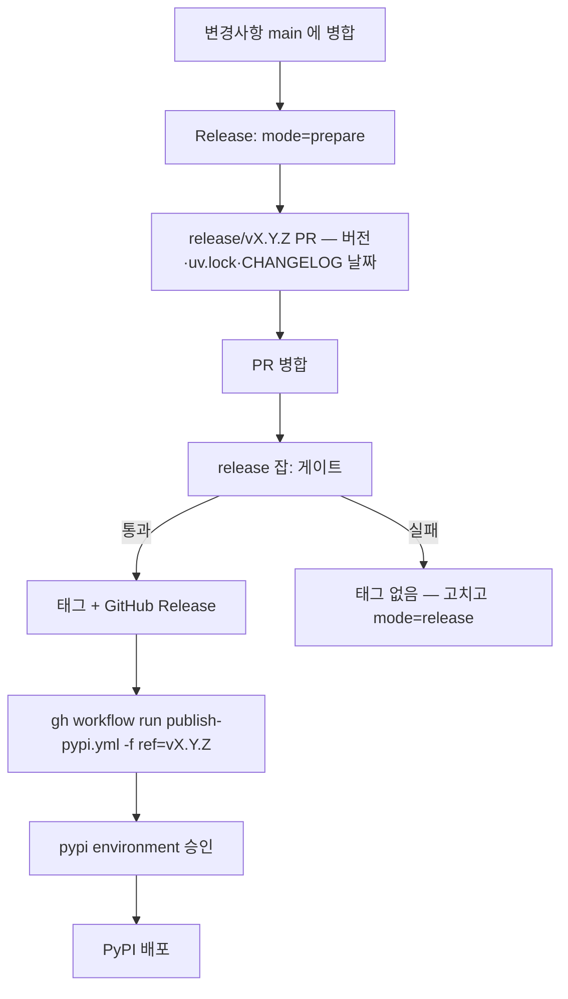

# Packaging and release strategy — KPubData

## 1. Packaging goals

- modern Python packaging
- Python 3.10+
- minimal core dependencies
- optional extras for heavier integrations
- reproducible local development for human and agentic workflows

## 2. Recommended choices

### Build backend

Use `hatchling` as the build backend.

Why:

- simple and modern
- PEP 517/518 friendly
- good fit for a typed library with `src/` layout

### Project metadata

Use PEP 621 metadata in `pyproject.toml`.

### Environment/workflow tool

Use `uv` for local sync/install/test workflows.

This keeps packaging standards-based while making developer workflows fast.

## 3. Python support policy

- minimum: Python 3.10
- tested: 3.10, 3.11, 3.12, 3.13

## 4. Dependency policy

### Core dependencies

Keep core lean.

Expected core set:

- `httpx` or `requests`-style HTTP client (choose one)
- XML parsing support only if truly needed in core
- typing/runtime helpers only when justified

### Optional extras

- `xml`
- `pandas`
- `mcp`
- `dev`
- `docs`

## 5. Recommended package structure

```text
src/
  kpubdata/
```

Reasons:

- avoids accidental import-from-project-root mistakes
- works well with modern build backends and type checking

## 6. Build and release steps

### Local

```bash
uv sync --extra dev
uv run ruff check .
uv run ruff format --check .
uv run mypy src
uv run pytest
uv run python -m build
```

### Release

릴리스는 사람이 누르고, 게이트를 통과한 **뒤에** 태그가 생긴다 (#586, ADR 0004). 세 단계다.

**언제 내는가는 [호환성 문서 §5.1](docs/compatibility.md#release-cadence) 이 정한다** — kpubdata 는
수시, 직전 정식 릴리스로부터 7일에 한 번까지. prepare·release 두 경로 모두 첫 단계가
`release-window` 게이트(`scripts/release_window.py`, `policy: on-demand`)이고, 7일 안이면
버전을 계산하기 전에 멈춘다. 보안 수정·릴리스를 막는 결함은 `critical_patch: true` 와
`critical_issue: #N` 으로 넘는다(이슈 번호 필수).

#### 1. 릴리스 PR 준비 — `Release` 워크플로, `mode=prepare`

1. GitHub → Actions → **Release** → **Run workflow** (브랜치 `main`)
2. `mode=prepare`, `bump` 선택: `patch` (0.7.0 → 0.7.1), `minor` (0.7.0 → 0.8.0), `pre` (0.7.0 → 0.7.1a0)
   - `dry_run` 을 켜면 새 버전만 계산하고 멈춘다 (브랜치·PR 없음)
3. 워크플로가 `release/vX.Y.Z` 브랜치와 PR 을 연다. PR 에는
   - `pyproject.toml` **과 `uv.lock`** 의 버전 (`.github/actions/set-version`)
   - `CHANGELOG.md` 의 `## [Unreleased]` 가 `## [X.Y.Z] — 날짜` 로 바뀐 것 (`scripts/release_notes.py promote`)
   가 들어간다. `[Unreleased]` 가 비어 있으면 여기서 멈춘다 — 먼저 변경 사항을 적는다.
4. 알려진 한계: `GITHUB_TOKEN` 으로 연 PR 에는 CI 가 붙지 않는다. 게이트는 2단계에서 다시 돈다.
5. 현재 저장소 설정은 Actions 가 PR 을 만드는 것을 막는다 — 2026-09-30 prepare 실행은
   `release/v0.8.0` 브랜치를 push 한 뒤 "GitHub Actions is not permitted to create or approve
   pull requests" 로 실패했다. 그러면 사람이 그 브랜치에서 PR 을 연다(개인 토큰으로 연 PR 에는
   CI 가 붙는다). 설정을 바꾸거나 `RELEASE_PR_TOKEN`(#589)을 두기 전까지는 이 단계가 수동이다.

#### 2. 병합 → 게이트 → 태그 → GitHub Release

릴리스 PR 을 병합하면 `Release` 워크플로의 release 잡이 **병합 커밋**에서
1. 브랜치 이름(`release/vX.Y.Z`)과 `pyproject.toml` 버전이 같은지 확인
2. 태그가 아직 없는지 확인
3. `CHANGELOG.md` 의 해당 절을 릴리스 노트로 추출 (없거나 비면 실패)
4. ruff · mypy · pytest 게이트
5. 통과하면 태그 push + GitHub Release 생성

첫 릴리스처럼 버전을 올리지 않고 선언된 버전을 그대로 내보낼 때는 `mode=release` 로
`main` 에서 실행한다 — 같은 release 잡이 `main` 의 head 를 대상으로 돈다.

#### 3. PyPI 발행 — `publish-pypi.yml` 을 태그로 실행

```bash
gh workflow run publish-pypi.yml -f ref=vX.Y.Z
```

PyPI trusted publisher 가 **시작된 워크플로 이름**(`publish-pypi.yml`)을 보기 때문에 release 잡에서
호출하지 못하고 한 번 더 실행한다 (#593). `pypi` environment 승인이 필요하다. release 잡이
끝나면 이 명령을 notice 로 출력한다.

#### 실패하면 무엇이 남나

| 멈춘 곳 | 남는 것 | 다시 하기 |
|---|---|---|
| 1단계 (promote·버전) | 없음 | 고치고 다시 실행 |
| 2단계 게이트까지 | 병합된 릴리스 PR 만, 태그 없음 | 수정 PR 병합 후 `mode=release` |
| 태그 push 후 Release 생성 실패 | 태그만 | 재실행하면 태그가 같은 커밋을 가리키는 한 Release 생성부터 이어간다 (#687) |
| `release-window` 거부 | 병합된 릴리스 PR 만, 태그 없음 | 실패한 job 재실행은 소용없다(같은 이벤트). 창 안에서, 또는 `critical_patch`·`critical_issue` 와 함께 `mode=release` 로 낸다 (§5.1) |
| 3단계 (PyPI) | 태그·Release, 패키지 없음 (v0.7.0 에서 실제로 일어남) | `gh workflow run publish-pypi.yml -f ref=vX.Y.Z` 재실행 |

#### 배포 전 체크리스트

- [ ] 릴리스에 들어갈 PR 이 모두 `main` 에 병합됨
- [ ] `CHANGELOG.md` `## [Unreleased]` 에 사용자에게 보이는 변경이 모두 적힘
- [ ] `SUPPORTED_DATA.md` 최신 상태 (`scripts/sync_supported_data.py --check`)

#### 배포 흐름도



#### 환경 설정

- **PyPI trusted publisher**: GitHub Actions OIDC, 워크플로 `publish-pypi.yml` — 별도 API 토큰 불필요
- **GitHub environment**: `pypi` (Settings → Environments)
- **Workflow 파일**: `.github/workflows/release.yml`, `.github/workflows/publish-pypi.yml`

## 7. Versioning policy

Use SemVer with public API discipline.

- `0.x`: fast iteration, but still document breaking changes
- `1.0`: only when the public Python API and adapter contract feel stable

## 8. Naming policy

- project name: `KPubData`
- package/import name: `kpubdata`
- repository name: preferably `kpubdata` or `kpubdata-framework`

---

## 관련 문서

### 이 저장소 내 문서
| 문서 | 설명 |
| :--- | :--- |
| [ARCHITECTURE.md](./ARCHITECTURE.md) | 시스템 아키텍처 설계 |
| [API_SPEC.md](./API_SPEC.md) | 파이썬 API 명세 |
| [VALIDATION.md](./VALIDATION.md) | 아키텍처 타당성 검증 |

