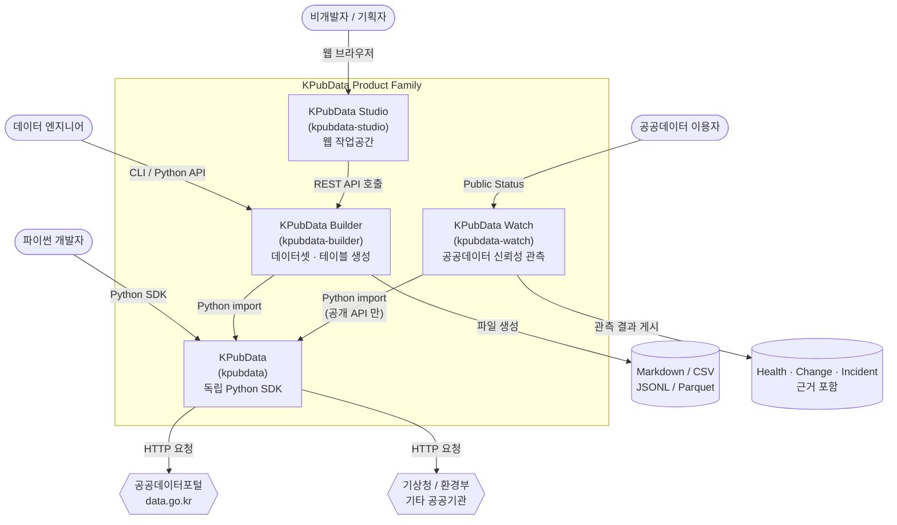
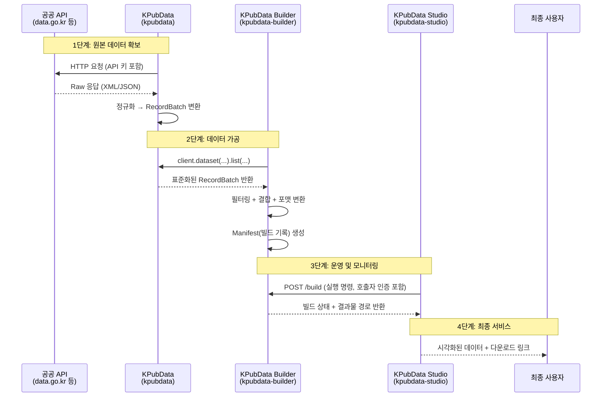
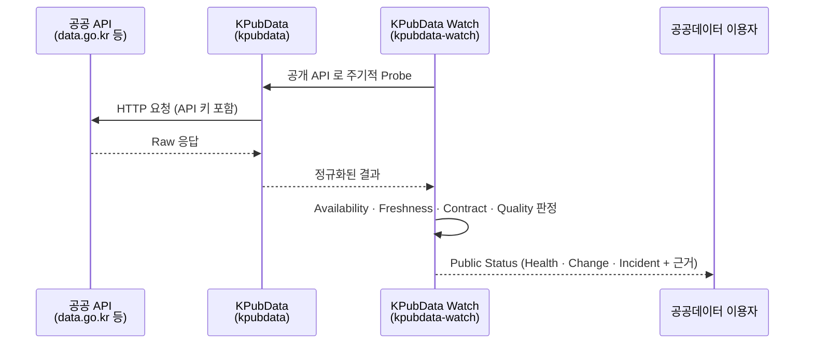
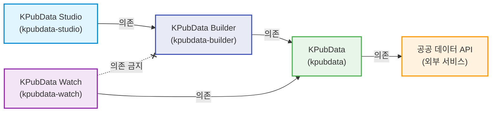

# KPubData Product Family — 전체 시스템 아키텍처

KPubData 는 한국 공공데이터 접근을 위한 **독립 Python SDK** 입니다. KPubData Builder, KPubData Studio, KPubData Watch 는 KPubData 위에 만들어진 **관련 프로젝트**이며, KPubData 는 이들 없이도 단독으로 설치·사용·릴리스됩니다. 이 문서는 네 제품을 함께 쓸 때의 관계를 설명합니다. 제품 이름과 저장소·패키지 이름은 다르다 — 저장소는 바꾸지 않는다([BRAND.md](brand/BRAND.md)).

의존은 한 방향으로만 흐릅니다: **Studio → Builder → KPubData**, 그리고 **Watch → KPubData**. Watch 는 Builder 의 하위 단계가 아니라 Builder 와 나란한 **형제 제품**이며 Builder·Studio 에 의존하지 않습니다([ADR 0007](adrs/0007-independence-rules.md) §5). KPubData 는 Builder·Studio·Watch 를 알지 못하고, 함께 사용할 때에만 공공데이터의 전체 생명주기가 하나의 흐름으로 이어집니다.

| 제품 | 저장소 · 패키지 | 한 줄 역할 | 기술 |
| :--- | :--- | :--- | :--- |
| **KPubData** | [kpubdata](https://github.com/kpubdata-lab/kpubdata) | 한국 공공데이터 접근을 위한 독립 Python SDK | Python 3.10+ |
| **KPubData Builder** | [kpubdata-builder](https://github.com/kpubdata-lab/kpubdata-builder) | KPubData를 활용해 재현 가능한 데이터셋·테이블을 생성하고 관리 | Python 3.10+ |
| **KPubData Studio** | [kpubdata-studio](https://github.com/kpubdata-lab/kpubdata-studio) | 한국 공공데이터를 수집하고, 출처와 이용 조건을 유지한 스냅샷으로 관리하며, 표와 SQL 로 분석하는 작업공간 | Vite + React Router + TypeScript (SPA) |
| **KPubData Watch** | [kpubdata-watch](https://github.com/kpubdata-lab/kpubdata-watch) | 한국 공공데이터 API 를 지속 관측해 "이 공공데이터를 지금 믿고 사용할 수 있는가?" 를 근거와 함께 공개하는 Public Data Reliability 서비스 | Python 3.12+ · 최소 Server-rendered UI |

---

## 0. KPubData Product Family가 뭔가요? (초보자를 위한 비유)

네 프로젝트의 관계를 **석유공업(정유산업)**에 비유하면 이해하기 쉽습니다.

### 원유 채굴 → 정유소 → 제어실

- **KPubData (`kpubdata`) = 원유 채굴·탈염 (Crude Extraction & Desalting)**
  - 전 세계 유전(공공기관 [API](https://ko.wikipedia.org/wiki/API))에서 원유(데이터)를 채굴합니다.
  - 유전마다 원유의 성분(응답 형식)과 채굴 조건(인증 방식)이 제각각입니다.
  - 탈염·탈수 공정(정규화)을 거쳐 불순물을 제거하고, 파이프라인에 넣을 수 있는 표준 원유로 만듭니다.

- **KPubData Builder (`kpubdata-builder`) = 정유소 (Refinery)**
  - 표준화된 원유를 레시피(빌드 기획서)에 따라 가솔린·경유·등유 등 다양한 석유 제품(Parquet, CSV, HuggingFace Dataset)으로 분리·가공합니다.
  - 같은 공정을 언제든 반복할 수 있도록 자동화된 플랜트를 운영합니다.

- **KPubData Studio (`kpubdata-studio`) = 제어실 (Control Room)**
  - 정유소의 가동 상태를 실시간 모니터링하고, 어떤 제품을 생산할지 주문(빌드 실행)을 내리는 제어 화면입니다.
  - 운영자가 직접 배관을 만질 필요 없이, 화면에서 클릭 몇 번으로 전체 공정을 관리합니다.

- **KPubData Watch (`kpubdata-watch`) = 유전 감시소 (Field Monitoring Station)**
  - 정유소를 거치지 않고, 채굴 장비(KPubData)로 유전 자체를 주기적으로 점검합니다 — 원유가 나오는지(가용성), 최근에 나온 원유인지(Freshness), 성분 표기가 바뀌지 않았는지(Contract), 양과 품질이 평소 같은지(Quality).
  - 점검 결과를 근거와 함께 게시판(Public Status)에 공개합니다. 정유소(Builder)와는 서로 의존하지 않는 형제 시설입니다.

```text
[유전 / 원유 채굴]        [정유소]              [제어실]
  KPubData     →   KPubData Builder   →   KPubData Studio
  (kpubdata)            (kpubdata-builder)      (kpubdata-studio)
  (채굴·탈염·표준화)     (석유 제품 생산)        (공정 제어·모니터링)
        ↑
  KPubData Watch
  (kpubdata-watch)
  (유전 감시·상태 공개)
```

---

## 1. 전체 시스템 관계도

네 저장소와 외부 [API](https://ko.wikipedia.org/wiki/API)(프로그램끼리 데이터를 주고받는 규칙), 그리고 최종 사용자 간의 관계입니다. **데이터는 아래에서 위로 흐르고, 제어(명령)는 위에서 아래로 내려갑니다.**



---

## 2. 전체 데이터 흐름

공공기관 서버에 있는 원본 데이터가 최종 사용자에게 전달되기까지의 여정입니다.



### 단계별 상세 설명

1. **원본 데이터 확보** (KPubData — `kpubdata`)
   - 각 공공기관의 API에 [HTTP](https://ko.wikipedia.org/wiki/HTTP)(인터넷 통신 규약) 요청을 보내 원본 데이터를 받아옵니다.
   - [XML](https://ko.wikipedia.org/wiki/XML)(태그 형식)이든 [JSON](https://ko.wikipedia.org/wiki/JSON)(중괄호 형식)이든 자동으로 판별하여 파이썬 객체로 변환합니다.
   - 기관마다 다른 에러 코드, 페이지 처리 방식 등을 표준 형태(`RecordBatch`)로 정규화합니다.

2. **데이터 가공** (KPubData Builder — `kpubdata-builder`)
   - kpubdata를 파이썬 라이브러리로 불러와(`import`) 데이터를 수집합니다.
   - 빌드 기획서([YAML](https://ko.wikipedia.org/wiki/YAML) — 들여쓰기로 구조를 표현하는 설정 파일)에 정의된 규칙에 따라 데이터를 변환합니다.
   - [Markdown](https://ko.wikipedia.org/wiki/%EB%A7%88%ED%81%AC%EB%8B%A4%EC%9A%B4), [CSV](https://ko.wikipedia.org/wiki/CSV), [JSONL](https://jsonlines.org/), [Parquet](https://parquet.apache.org/) 등 원하는 형식의 파일을 생성합니다.

3. **운영 및 모니터링** (KPubData Studio — `kpubdata-studio`)
   - 웹 브라우저를 통해 빌드를 시작하거나 상태를 확인합니다.
   - Builder 가 제공하는 [REST API](https://ko.wikipedia.org/wiki/REST)(웹을 통해 데이터를 주고받는 방식)를 호출하여 통신합니다.
   - Builder 는 요청마다 호출자를 인증합니다 — 서비스 계정은 `X-API-Key`, 사람 사용자(Studio)는 OIDC IdP 가 발급한 `Authorization: Bearer` 토큰입니다.

4. **최종 서비스** (studio → 사용자)
   - 사용자는 웹 화면에서 빌드 결과물을 미리보기하고, 다운로드할 수 있습니다.

### Watch 의 흐름

Watch 는 위 흐름의 한 단계가 아니라 **나란히 도는 별도 흐름**입니다. Builder 산출물이 아니라 공공 API 자체를 관측합니다.



---

## 3. 각 저장소의 역할과 경계

### 역할 비교표

| 구분 | KPubData (`kpubdata`) | KPubData Builder (`kpubdata-builder`) | KPubData Studio (`kpubdata-studio`) | KPubData Watch (`kpubdata-watch`) |
| :--- | :--- | :--- | :--- | :--- |
| **비유** | 원유 수입·정제 | 정유소 (Refinery) | 제어실 (Control Room) | 유전 감시소 (Field Monitoring Station) |
| **핵심 역할** | 공공 API 연결, 인증, 데이터 정규화 | 데이터 변환, 파일 내보내기, 빌드 이력 관리 | 빌드 모니터링, 설정 UI, 결과 시각화 | 공공 API 지속 관측, 신뢰성 판정, 상태 공개 |
| **주요 산출물** | `RecordBatch` (표준화된 데이터 객체) | 파일 (Markdown, CSV 등) + `manifest.json` | 웹 대시보드 화면 | Public Status (Health · Change · Incident + 근거) |
| **주요 사용자** | 파이썬 개발자 | 데이터 엔지니어, 분석가 | 비개발자, 기획자, 운영자 | 공공데이터를 쓰는 개발자·분석가 |

### 하는 일 / 하지 않는 일

**KPubData (`kpubdata`)**
- 하는 일: 공공 API 연결, 공공기관이 발급한 API 키를 요청에 주입, XML/JSON 응답 파싱, 데이터 정규화, 에러 표준화, 원본 데이터 접근(`call_raw`)
- 하지 않는 일: 데이터 저장, 복잡한 변환/가공, 파일 생성, 웹 UI 제공, 자신을 호출하는 사용자의 인증/인가(라이브러리이므로 호출자 개념이 없음)

**KPubData Builder (`kpubdata-builder`)**
- 하는 일: 빌드 기획서(BuildSpec) 검증, kpubdata를 통한 데이터 수집, 데이터 결합/필터링, 다양한 형식으로 내보내기, Manifest 생성, HTTP 서비스 호출자 인증(`X-API-Key` 또는 OIDC Bearer 토큰)과 빌드 실행(run) 소유권 확인
- 하지 않는 일: 직접적인 API 통신(kpubdata에 위임), 웹 UI 제공, 사용자 계정 발급·로그인 화면(외부 OIDC IdP 의 일 — Builder 는 발급된 토큰을 검증만 함)

> Builder 의 인증은 두 경로입니다(`kpubdata-builder` 의 `src/kpubdata_builder/service/auth.py`). `X-API-Key` 는 서버의 `KPUBDATA_BUILDER_API_KEY` 와 비교하는 서비스 계정 경로이고, `Authorization: Bearer` 는 `OIDC_ISSUER` 가 설정된 배포에서만 켜지는 사람 사용자 경로입니다. 소유권 확인(`service/ownership.py`)은 `ENFORCE_OWNERSHIP` 이 켜져 있거나 OIDC 가 설정된 배포에서 적용되며, 그때 빌드 실행은 만든 사람의 것입니다. 이것은 **Builder 호출자**의 인증이고, KPubData 가 공공 API 에 보내는 **기관 API 키**와는 별개입니다.

**KPubData Studio (`kpubdata-studio`)**
- 하는 일: 빌드 기획서 시각적 편집, 빌드 실행/상태 모니터링, 결과물 미리보기, 게시(Publish) 관리
- 하지 않는 일: 데이터 직접 가공, 원본 API 호출, 빌드 로직 구현(Builder 에 위임)

**KPubData Watch (`kpubdata-watch`)**
- 하는 일: 공공 API 주기적 관측(Probe), Availability·Freshness·Contract·Quality 판정, Change·Incident 기록, 판정 근거(Expected·Observed·Rule·Evidence)와 함께 Public Status 공개
- 하지 않는 일: 직접적인 API 통신 구현(kpubdata 에 위임), 데이터셋·테이블 생성(Builder 의 일), Builder·Studio 에 의존

---

## 4. 의존성 방향

네 프로젝트의 의존성은 **항상 한 방향**으로만 흐릅니다. 하위 프로젝트는 상위 프로젝트가 존재하는지 알 필요가 없습니다.



### 의존성 규칙

| 규칙 | 설명 | 비유 |
| :--- | :--- | :--- |
| **Studio → Builder** | Studio는 Builder 의 API를 호출할 수 있음 | 제어실이 정유소에 생산 명령을 내림 |
| **Builder → KPubData** | Builder 는 KPubData(`kpubdata`)를 파이썬 라이브러리로 import하여 사용 | 정유소는 원유 수입사로부터 원유를 공급받음 |
| **Watch → KPubData** | Watch 는 KPubData 의 **문서화된 공개 API** 만 import하여 사용 (Builder 와 같은 조건) | 감시소는 채굴 장비를 빌려 유전을 직접 점검함 |
| **Watch ↛ Builder · Studio** | Watch 는 Builder·Studio 를 import하거나 의존성으로 선언하지 않음. 상호운용이 필요하면 Manifest · Artifact · Protocol 로 처리 | 감시소는 정유소 설비에 기대지 않음 |
| **KPubData → 공공 API** | KPubData 는 외부 공공기관 서버에 HTTP 요청을 보냄 | 원유 수입사는 유전(공공기관)에서 원유를 채굴함 |
| **역방향 금지** | KPubData 는 Builder·Watch 를, Builder 는 Studio 를 절대 import하거나 호출하지 않음 | 유전이 정유소에게 "이거 만들어"라고 지시하지 않음 |

---

## 5. 자세한 구현 문서

각 프로젝트의 기술 스택, 배포 환경, 통신 방식, 로드맵 등 세부 사항은 각 저장소의 문서를 참고하세요.

함께 쓸 수 있는 버전 조합은 [호환성 매트릭스](compatibility.md)에 있습니다. 그 표는 Builder·Studio 릴리스가 검증한 KPubData 버전을 적은 것이고 Builder·Studio 릴리스 때에만 바뀌므로, **KPubData 의 현재 버전**(`pyproject.toml`, [CHANGELOG](https://github.com/kpubdata-lab/kpubdata/blob/main/CHANGELOG.md))은 표의 버전보다 앞서 있을 수 있습니다. KPubData 는 단독으로 릴리스되기 때문입니다.

| 제품 (저장소) | README | ARCHITECTURE |
| :--- | :--- | :--- |
| KPubData (`kpubdata`) | [README.md](https://github.com/kpubdata-lab/kpubdata/blob/main/README.md) | [ARCHITECTURE.md](https://github.com/kpubdata-lab/kpubdata/blob/main/ARCHITECTURE.md) |
| KPubData Builder (`kpubdata-builder`) | [README.md](https://github.com/kpubdata-lab/kpubdata-builder/blob/main/README.md) | [ARCHITECTURE.md](https://github.com/kpubdata-lab/kpubdata-builder/blob/main/ARCHITECTURE.md) |
| KPubData Studio (`kpubdata-studio`) | [README.md](https://github.com/kpubdata-lab/kpubdata-studio/blob/main/README.md) | [ARCHITECTURE.md](https://github.com/kpubdata-lab/kpubdata-studio/blob/main/ARCHITECTURE.md) |
| KPubData Watch (`kpubdata-watch`) | [README.md](https://github.com/kpubdata-lab/kpubdata-watch/blob/main/README.md) | [docs/architecture](https://github.com/kpubdata-lab/kpubdata-watch/blob/main/docs/architecture/README.md) |
